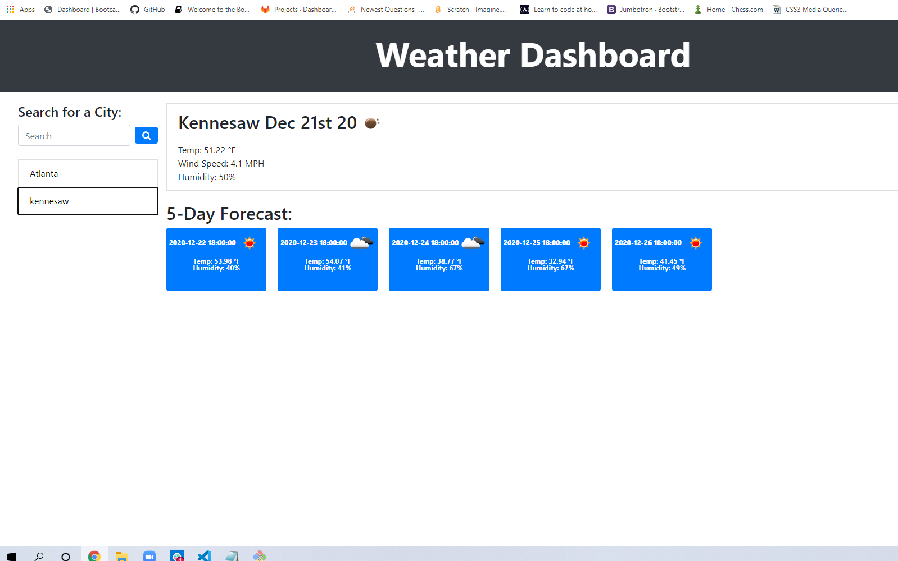

# api-weather-dashboard

## Project Description "Weather Dashboard" 

This weather dashboard application with search functionality to find a weather condition of a given city and 5 day forecast.
The server side API [OpenWeather API](https://openweathermap.org/api) used to retrieving data from their own data content.  
This app will run in the browser and feature dynamically updated HTML, CSS and powered by jQuery and Ajax.

**Technologies used:** 
* HTML
* CSS
* moment.js
* ajax
* jQuery
* Javascript
* API-DOM
* Bootstrap

### Research Link

* [Google](https://www.google.com)
* [w3school.com](https://www.w3schools.com/html/html5_semantic_elements.asp)
* [developer.mozilla.org](https://developer.mozilla.org/en-US/docs/Glossary/Semantics)
* [stackoverflow.com/](https://stackoverflow.com//)

### Application links

* [deployed application](https://mugich.github.io/api-weather-dashboard/)

* [GitHub repositories](https://github.com/mugich/api-weather-dashboard)

### Application's appearance

